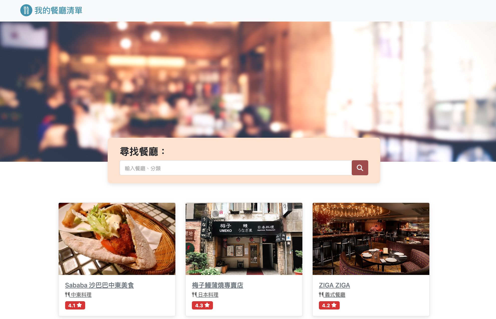

# 我的餐廳清單



## 介紹

紀錄屬於自己的餐廳清單，可以瀏覽餐廳、查看詳細資訊，並連結到地圖。

### 功能

- 查看所有餐廳
- 瀏覽餐廳的詳細資訊
- 連結餐廳的地址到 Google 地圖
- 搜尋特定餐廳

## 使用說明

1. 開啟終端機(Terminal)cd 到存放專案本機位置並執行

   ```bash
   npm install
   ```

2. 初始

   ```bash
   cd Restaurant_list
   ```

   ```bash
   npm install
   ```

3. 安裝完畢後繼續輸入：

   ```bash
   npm run dev
   ```

4. 若看見此行訊息則代表順利運行：

   ```bash
   Express is running on http://localhost:3000
   ```

5. 請打開瀏覽器進入到以下網址：

  ``` bash 
  http://localhost:3000
  ```

6. 若欲暫停使用

   ```bash
   ctrl + c
   ```

## 開發工具

- Node.js 18.16.0
- Express 4.16.4
- Express-Handlebars 3.0.0
- Bootstrap 5.1.3
- Font-awesome 6.4.0