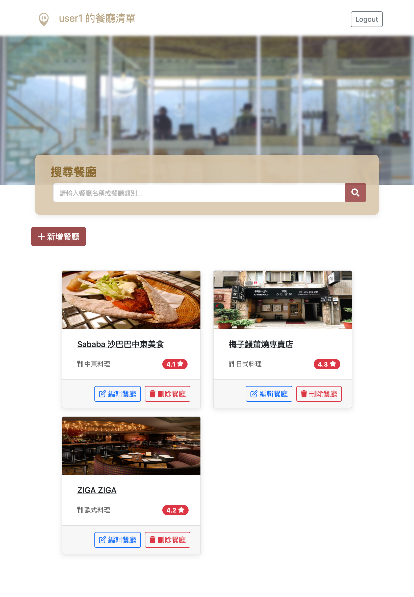

# 我的餐廳清單



## 介紹

使用者可註冊自己的帳號，記錄屬於自己的餐廳清單。

### 功能

- 使用者可以註冊自己的帳號登入，或使用 Facebook 登入
- 新增屬於自己的餐廳清單
- 查看所有餐廳
- 刪除餐廳
- 編輯餐廳的資訊
- 瀏覽餐廳的詳細資訊
- 連結餐廳的地址到 Google 地圖
- 搜尋特定餐廳名稱或餐廳類別


## 使用說明

1. 請先確認有安裝 `node.js` 與 `npm`

2. 將專案 clone 到本地

   ```bash
   git clone https://github.com/chiangjou/restaurant_list_v.3.git
   ```

3. 透過終端機進入資料夾 `restaurant_list_v.3`

   ```bash
   cd restaurant_list_v.3
   ```
   
5. 輸入

   ```bash
   npm install
   ```

6. 安裝完畢後，請參考 `.env.example` 文件建立你的 `.env` 文件

7. 連線完畢後，繼續輸入：

   ```bash
   npm run dev
   ```

8. 若看見此行訊息則代表順利運行，打開瀏覽器進入 `http://localhost:3000`

   ```bash
   Express is listening on http://localhost:3000
   ```

9. 若欲暫停使用

   ```bash
   ctrl + c
   ```

### Test account

>* name: user1
>* email: user1@example.com
>* password: 12345678

>* name: user2
>* email: user2@example.com
>* password: 12345678

## 開發工具

- Node.js 18.16.0
- bcryptjs: 2.4.3
- connect-flash: 0.1.1
- express 4.16.4
- express-handlebars 4.0.2
- express-session: 1.17.1
- method-override: 3.0.0
- mongoose: 5.9.7
- passport: 0.4.1
- passport-facebook: 3.0.0
- passport-local: 1.0.0
- Bootstrap 5.1.3
- Font-awesome 6.4.0
